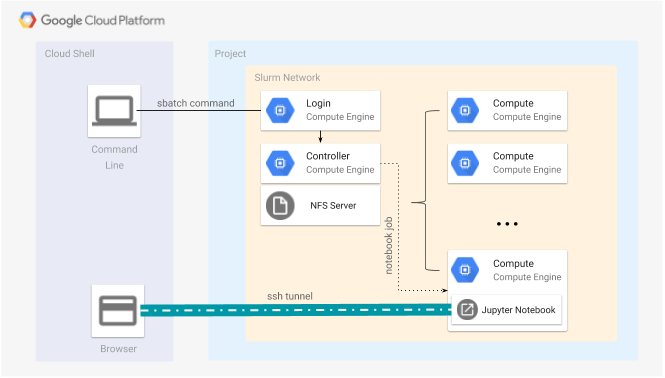
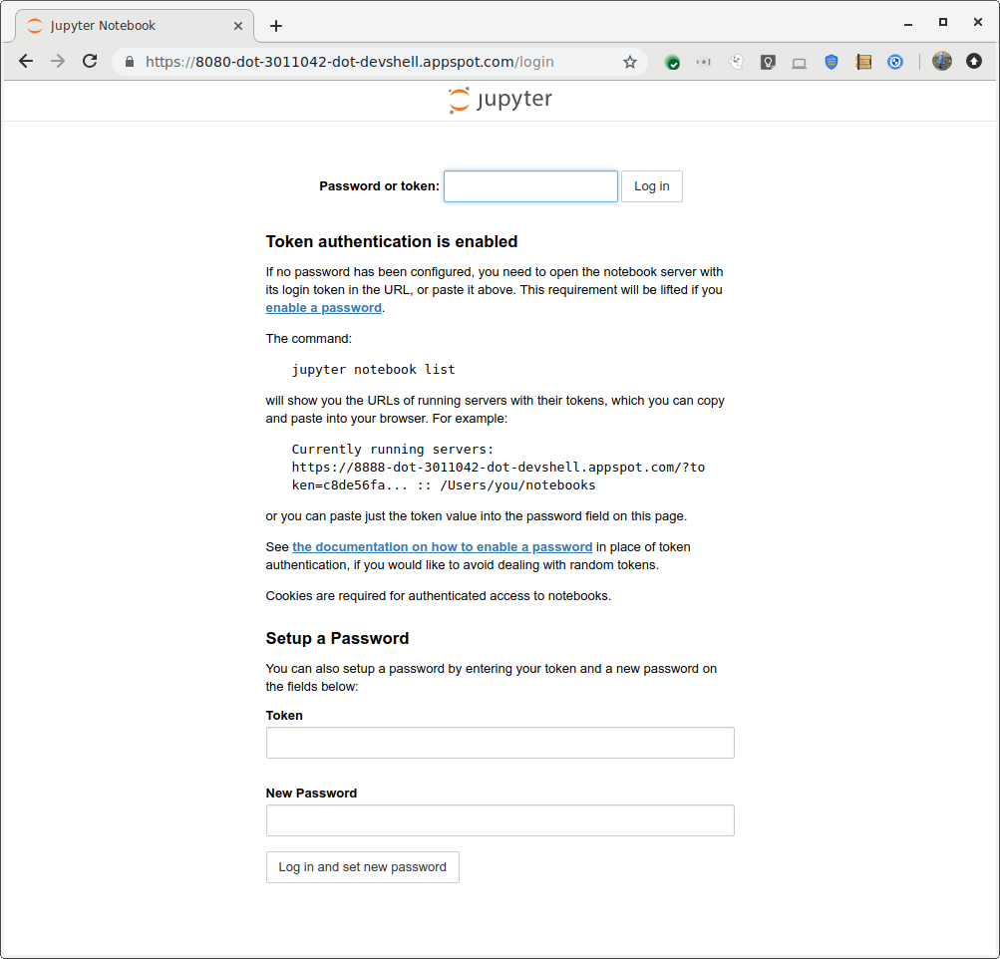

This tutorial shows you how to run a [Jupyter Notebook](https://jupyter.org) as a job managed by the [Slurm Resource Manager](https://slurm.schedmd.com).
Slurm is a popular resource manager used in many High Performance Computing centers. Jupyter notebooks are a
favorite tool of Machine Learning and Data Science specialists. While they are often run on an individual user's
laptop there are situations that call for specialized hardware, e.g., GPUs, or more memory or cores than are
available locally. In those situations Slurm can allocate a compute instance has the requisite hardware
or memory/cpu resources to run the user's notebook for a bounded time period.

This diagram illustrates the configuration you will create by following the tutorial steps.


[](https://console.cloud.google.com/cloudshell/open?git_repo=https://github.com/GoogleCloudPlatform/community&page=editor&tutorial=tutorials/using-slurm-to-host-jupyter-notebooks/index.md)

## (OPTIONAL) Create a project with a billing account attached 
**(you can also use an existing project and skip to the next step)**

Edit <walkthrough-editor-open-file filePath="community/tutorials/using-slurm-to-host-jupyter-notebooks/env.sh">env.sh</walkthrough-editor-open-file> setting these variables to reflect your environment.
- <walkthrough-editor-select-regex filePath="community/tutorials/using-slurm-to-host-jupyter-notebooks/env.sh" regex="\[YOUR_ORG\]">organization</walkthrough-editor-select-regex>
- <walkthrough-editor-select-regex filePath="community/tutorials/using-slurm-to-host-jupyter-notebooks/env.sh" regex="\[YOUR_BILLING_ACCOUNT_NAME\]">billing account</walkthrough-editor-select-regex>
- <walkthrough-editor-select-regex filePath="community/tutorials/using-slurm-to-host-jupyter-notebooks/env.sh" regex="\[NAME FOR THE PROJECT YOU WILL CREATE\]">project name</walkthrough-editor-select-regex>
- <walkthrough-editor-select-regex filePath="community/tutorials/using-slurm-to-host-jupyter-notebooks/env.sh" regex="\[COMPUTE ZONE YOU WANT TO USE\]">zone</walkthrough-editor-select-regex>

```bash
source ./env.sh
```
```bash
gcloud projects create $PROJECT --organization=$ORG
```
```bash
gcloud beta billing projects link $PROJECT --billing-account=$(gcloud beta billing accounts list | grep $BILLING_ACCOUNT | awk '{print $1}')
```
```bash
gcloud config configurations create -- activate $PROJECT
```
```bash
gcloud config set compute/zone $ZONE
```

## Enable the required Google APIs
```bash
gcloud services enable compute.googleapis.com
```

## Create a Slurm cluster

1. Clone the Slurm for GCP Git repository
```bash
git clone https://github.com/schedmd/slurm-gcp.git
```
```bash
cd slurm-gcp
```

2. Modify slurm-cluster.yaml for your environment

You need to customize the <walkthrough-editor-open-file filePath="community/tutorials/using-slurm-to-host-jupyter-notebooks/slurm-gcp/slurm-cluster.yaml">slurm-cluster.yaml</walkthrough-editor-open-file> file
for your environment before you deploy your cluster.

* Uncomment this <walkthrough-editor-select-regex filePath="community/tutorials/using-slurm-to-host-jupyter-notebooks/slurm-gcp/slurm-cluster.yaml" regex="login_node_count">line</walkthrough-editor-select-regex>.
If you want more than one login node modify the value of ```login_node_count``` accordingly.
* Add a comma separated list of the user ids authorized to use your cluster on the
<walkthrough-editor-select-regex filePath="community/tutorials/using-slurm-to-host-jupyter-notebooks/slurm-gcp/slurm-cluster.yaml" regex="default_user">default user</walkthrough-editor-select-regex>
line

You may also want to make one or more optional changes:

* Deploy your cluster to a different region and/or zone by modifying the values
<walkthrough-editor-select-regex filePath="community/tutorials/using-slurm-to-host-jupyter-notebooks/slurm-gcp/slurm-cluster.yaml" regex="region.*:">here</walkthrough-editor-select-regex>
and <walkthrough-editor-select-regex filePath="community/tutorials/using-slurm-to-host-jupyter-notebooks/slurm-gcp/slurm-cluster.yaml" regex="zone.*:">here</walkthrough-editor-select-regex>
* Use a different type of <walkthrough-editor-select-regex filePath="community/tutorials/using-slurm-to-host-jupyter-notebooks/slurm-gcp/slurm-cluster.yaml" regex="compute_machine_type">compute node</walkthrough-editor-select-regex>, 
e.g., if you need more cores or memory than are available in the default choice of ```n1-standard-2```
* Use an existing <walkthrough-editor-select-regex filePath="community/tutorials/using-slurm-to-host-jupyter-notebooks/slurm-gcp/slurm-cluster.yaml" regex="vpc_net">VPC network</walkthrough-editor-select-regex> and
<walkthrough-editor-select-regex filePath="community/tutorials/using-slurm-to-host-jupyter-notebooks/slurm-gcp/slurm-cluster.yaml" regex="vpc_subnet">VPC subnet</walkthrough-editor-select-regex> combination. The
network/subnet requirements are described in the file ```slurm.jinja.scheme```
* Specify a different <walkthrough-editor-select-regex filePath="community/tutorials/using-slurm-to-host-jupyter-notebooks/slurm-gcp/slurm-cluster.yaml" regex="slurm_version">version</walkthrough-editor-select-regex>
of Slurm for your cluster. By default the latest stable version, 17.11.8 at the time of this writing, will be deployed

3. Patch the Slurm startup-script

You need to patch the script that is run on each cluster node at startup. The changes in the patch setup the symbolic links
and directories to support the installation of software packages shared across nodes and the [environment modules](http://modules.sourceforge.net) used
to access those packages.

```bash
patch scripts/startup-script.py ../startup-script.patch
```

4. Deploy Slurm using Deployment Manager

Use Deployment Manager to deploy your cluster.
```bash
gcloud deployment-manager deployments --project="$(gcloud config get-value core/project)" create slurm --config slurm-cluster.yaml
```

5. Verify that your cluster is operational

It will take five to ten minutes after the deployment completes for your cluster's configuration
to complete. Wait ten minutes and then use these commands to verify that your cluster is operational.

```bash
gcloud compute ssh google1-login1 --command 'sbatch -N2 --wrap="srun hostname"'
```

```bash
gcloud compute ssh google1-login1 --command 'cat slurm-*.out'
```

You should see output that looks like:
```
google1-compute1
google1-compute2
```

## Setup an Anaconda environment module

Environment modules update your environment variables, e.g., PATH, MANPATH, LD_LIBRARY_LOAD, etc., to include information necessary
to access specific software components. In this step you will install the [Anaconda](https://www.anaconda.com) package for Python 3.x and create an
environment module for it.

1. Install the Anaconda3 package

Download the Anaconda3 (version 5.3.1) package
```bash
gcloud compute ssh google1-controller --command 'sudo wget --directory-prefix=/tmp https://repo.anaconda.com/archive/Anaconda3-5.3.1-Linux-x86_64.sh'
```

Install Anaconda3 (version 5.3.1) in the /apps directory so that each of the Slurm compute nodes can access it.
```bash
gcloud compute ssh google1-controller --command 'sudo chmod a+x /tmp/Anaconda3-5.3.1-Linux-x86_64.sh; sudo /tmp/Anaconda3-5.3.1-Linux-x86_64.sh -b -p /apps/anaconda3/5.3.1 -f'
```

2. Create a modulefile for your Anaconda3 installation

Create an anaconda3 directory in the ```/apps/modulefiles``` directory. Each installed version of Anaconda3 will have a separate
appropriately named modulefile.
```bash
gcloud compute ssh google1-controller --command 'sudo mkdir -p /apps/modulefiles/anaconda3'
```

Copy the modulefile for Anaconda3 (version 5.3.1) to the controller node.
```bash
cd ..
```

```bash
gcloud compute scp anaconda3-5.3.1-modulefile google1-controller:/tmp
```

Move the Anaconda3 (version 5.3.1) modulefile into the ```/apps/modulefiles/anaconda3``` directory.
```bash
gcloud compute ssh google1-controller --command 'sudo mv /tmp/anaconda3-5.3.1-modulefile /apps/modulefiles/anaconda3/5.3.1'
```

3. Verify that the anaconda3/5.3.1 module is available
```bash
gcloud compute ssh google1-login1 --command 'module avail'
```

You should see output that looks like
```
------------------------ /usr/share/Modules/modulefiles ------------------------
dot         module-git  module-info modules     null        use.own
------------------------------- /etc/modulefiles -------------------------------
mpi/openmpi-x86_64
------------------------------ /apps/modulefiles -------------------------------
anaconda3/5.3.1
```

## Run a Jupyter Notebook as a Slurm batch job

You run a Jupyter Notebook as a batch job by submitting the ```notebook.batch``` file to 
slurm via the ```sbatch``` command.

1. Copy the ```notebook.batch``` file to your cluster's login node.

All of the ```sbatch``` directives for the notebook job are at the top of the ```notebook.batch```
file. 

```
#SBATCH --partition debug
#SBATCH --nodes 1
#SBATCH --ntasks-per-node 1
#SBATCH --mem-per-cpu 2G
#SBATCH --time 1-0:00:00
#SBATCH --job-name jupyter-notebook
#SBATCH --output jupyter-notebook-%J.log
```

If you need to modify them, e.g., to have more memory per CPU or a different
lifetime for your notebook, do so before you copy it to your cluster's login node.

Use the ```scp``` command to copy ```notebook.batch``` to your cluster's login node.

```bash
gcloud compute scp notebook.batch google1-login1:~
```

2. Submit the notebook job using the ```sbatch``` command.

```bash
gcloud compute ssh google1-login1 --command 'sbatch notebook.batch'
```

You should see output that looks like this:
```
Submitted batch job nn
```

Where *nn* is the job number for your notebook.

3. Verify that your Jupyter Notebook started up properly.

Substitute your notebook's job number for [NN] in this command to verify that your
notebook job started up properly.

```bash
gcloud compute ssh google1-login1 --command 'cat jupyter-notebook-nn.log'
```

You should see output that looks like this:
```
CloudShell port forward command for WebPreview
gcloud compute ssh google1-compute2 -- -A -t -l wkh_google_com -L 8080:10.10.0.4:8080

[I 18:41:52.465 NotebookApp] JupyterLab extension loaded from /apps/anaconda3/5.3.1/lib/python3.7/site-packages/jupyterlab
[I 18:41:52.468 NotebookApp] JupyterLab application directory is /apps/anaconda3/5.3.1/share/jupyter/lab
[I 18:41:52.480 NotebookApp] Serving notebooks from local directory: /home/wkh_google_com
[I 18:41:52.483 NotebookApp] The Jupyter Notebook is running at:
[I 18:41:52.486 NotebookApp] http://google1-compute2:8080/?token=5f8bc1a29d0bfd6f3cbdbd29186359bc47f04054b9f7cf86
[I 18:41:52.488 NotebookApp] Use Control-C to stop this server and shut down all kernels (twice to skip confirmation).
[C 18:41:52.494 NotebookApp]

    Copy/paste this URL into your browser when you connect for the first time,
    to login with a token:
        http://google1-compute2:8080/?token=5f8bc1a29d0bfd6f3cbdbd29186359bc47f04054b9f7cf86
[I 18:43:57.756 NotebookApp] 302 GET /?authuser=0 (10.10.0.4) 0.82ms
[I 18:43:57.830 NotebookApp] 302 GET /tree?authuser=0 (10.10.0.4) 1.00ms
[W 18:44:02.879 NotebookApp] 401 POST /login?next=%2Ftree%3Fauthuser%3D0 (10.10.0.4) 1.73ms referer=https://8080-dot-3011042-dot-devshell.appspot.com/login?next=%2Ftree%3Fauthuser%3D0
[W 18:44:54.375 NotebookApp] 401 POST /login?next=%2Ftree%3Fauthuser%3D0 (10.10.0.4) 4.27ms referer=https://8080-dot-3011042-dot-devshell.appspot.com/login?next=%2Ftree%3Fauthuser%3D0
[W 18:45:09.963 NotebookApp] 401 POST /login?next=%2Ftree%3Fauthuser%3D0 (10.10.0.4) 4.88ms referer=https://8080-dot-3011042-dot-devshell.appspot.com/login?next=%2Ftree%3Fauthuser%3D0
[I 18:46:29.529 NotebookApp] 302 GET /?authuser=0 (10.10.0.4) 0.70ms
[I 18:46:29.671 NotebookApp] 302 GET /tree?authuser=0 (10.10.0.4) 0.88ms
[I 18:46:33.473 NotebookApp] 302 POST /login?next=%2Ftree%3Fauthuser%3D0 (10.10.0.4) 1.14ms
[I 18:48:36.214 NotebookApp] 302 GET /?authuser=0 (10.10.0.4) 0.74ms
[I 18:49:14.889 NotebookApp] 302 GET /?authuser=0 (10.10.0.4) 0.72ms
[I 18:50:41.854 NotebookApp] 302 GET /?authuser=0 (10.10.0.4) 0.63ms
```

## Setup an ssh tunnel to your Notebook

You can access your notebook from the Cloud Shell using the Web Preview <walkthrough-web-preview-icon/> tool.

1. Get the login token for your notebook

Substitute your notebook's job number for *nn* in this command to get the login token for your notebook.

```
gcloud compute ssh google1-login1 --command 'cat jupyter-notebook-[NN].log' 2> /dev/null | egrep '^\[' | grep '?token' | awk -F'=' '{print $2}'
```

Save this value as you will need it to login to your notebook.

2. Create an ssh tunnel to your notebook

Your ```jupyter-notebook-[NN].log``` file contains the gcloud command you run to create an ssh
tunnel to your notebook. You can run it with this command.

Substitute your notebook's job number for [NN] in this command to create an ssh tunnel to your notebook.

```
$(gcloud compute ssh google1-login1 --command 'cat jupyter-notebook-nn.log' 2> /dev/null | egrep '^gcloud')
```

## Connect to your Notebook

Click on the <walkthrough-web-preview-icon/> and choose the ```Preview on port 8080``` option to
connect to your notebook. 

This will open a new browser window that connects to your notebook via
the ssh tunnel you setup in the previous step. 



Login by pasting the token you saved in the previous
step into the *Password or token* field and then pressing the login button.

## Clean up

Delete your Slurm cluster deployment
```bash
gcloud deployment-manager deployments --project="$(gcloud config get-value core/project)" delete slurm 
```
